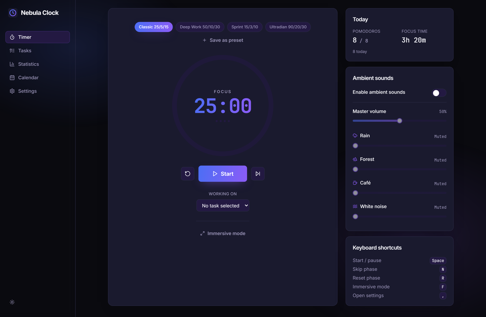
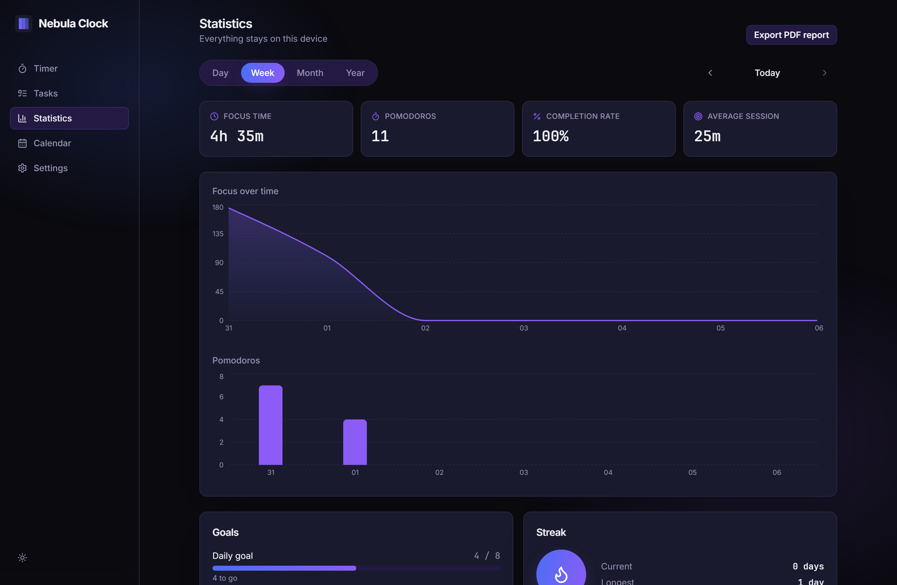
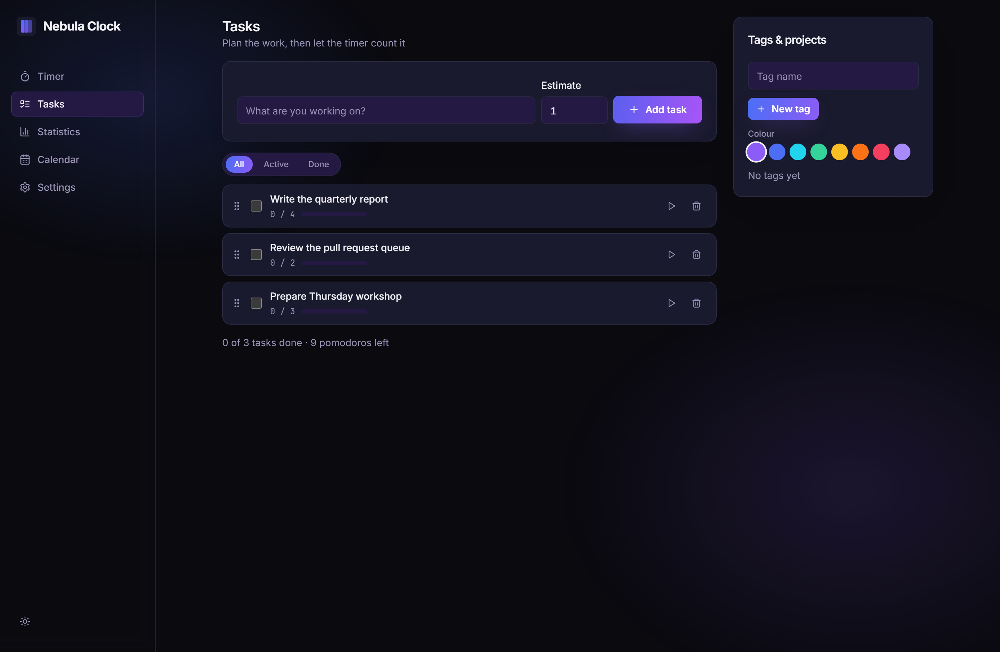
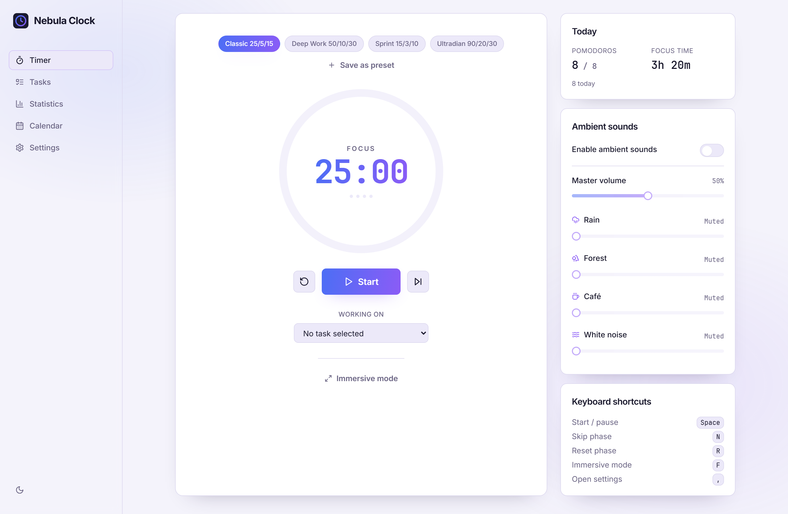

# Nebula Clock

A privacy-first Pomodoro time manager, shipped as an installable **PWA** and as
a native **desktop app** (Windows / macOS / Linux) from a single codebase.

Part of the **Nebula** family — the design tokens, the logo and the dark
blue-to-violet identity are taken verbatim from the Nebula desktop app, so the
two products look like siblings.

> **Everything stays on your device.** No account, no server, no telemetry.
> Data lives in IndexedDB and only ever leaves through an export _you_ trigger.

---

## Screenshots

| Timer (dark)                                                                | Statistics                                         |
| --------------------------------------------------------------------------- | -------------------------------------------------- |
|  |  |

| Tasks                                                                | Timer (light)                                                                 |
| -------------------------------------------------------------------- | ----------------------------------------------------------------------------- |
|  |  |

Regenerate them with a preview server running:

```bash
node apps/web/scripts/capture-screenshots.mjs http://localhost:4173
```

---

## Status

| Area                                                 | State                                             |
| ---------------------------------------------------- | ------------------------------------------------- |
| `packages/core` — timer engine, storage, stats, i18n | ✅ 164 unit tests, 98.7 % coverage                |
| `packages/ui` — Nebula design system                 | ✅ Complete                                       |
| `apps/web` — PWA renderer                            | ✅ 23 store tests + 32 Playwright end-to-end      |
| `apps/desktop` — Electron shell                      | ✅ Tray, global shortcuts, mini mode, auto-update |
| CI/CD                                                | ✅ Build matrix, semantic-release, Pages          |

Windows installer verified end to end; macOS and Linux artifacts are produced
by the release matrix but have not been run by hand. See
[the Electron manual test plan](docs/manual-testing-electron.md).

---

## Architecture

A pnpm workspace with a hard split between business logic and presentation:

```
nebula-clock/
├── packages/
│   ├── core/     Framework-free logic. Imports no React, no DOM, no Electron.
│   │             ├── timer/    Pure state machine (idle→running→paused, focus/break)
│   │             ├── storage/  Dexie schema, repositories, JSON + CSV portability
│   │             ├── stats/    Aggregation, streaks, badges, calendar
│   │             ├── config/   Every default value in the app
│   │             ├── i18n/     fr + en catalogues, split by domain
│   │             ├── sounds/   Two-bus audio mixer (notifications ∥ ambient)
│   │             └── notifications/  One interface, web + Electron adapters
│   └── ui/       Nebula tokens (CSS variables) + shared React components
└── apps/
    ├── web/      Vite + React 18. Also serves as the Electron renderer.
    └── desktop/  Electron main + preload, electron-builder packaging
```

**Why this split.** `packages/core` has no framework dependency, so the entire
Pomodoro cycle is unit-testable by feeding it timestamps — no fake DOM, no
component rendering. React components hold presentation only; every decision
lives in the machine or in a store.

### The timer is timestamp-based, not interval-based

`setInterval` drifts, and browsers throttle background tabs to once a minute.
The machine therefore stores _when_ the current run segment started and derives
elapsed time from the wall clock on demand. The 500 ms ticker is only a polling
mechanism: it decides how quickly a finished phase is _noticed_, never how long
it actually lasted. Waking a laptop after two hours settles the timer correctly
on the next tick — and a single phase advances, so the statistics are never
padded with sessions that did not happen.

---

## Getting started

Requires **Node ≥ 20.11** and **pnpm 11**.

```bash
pnpm install
```

### Web (PWA)

```bash
pnpm dev
```

### Desktop (Electron)

```bash
pnpm dev:desktop
```

### Build

```bash
pnpm build           # PWA → apps/web/dist
pnpm build:desktop   # installers → apps/desktop/release
```

---

## Scripts

| Command              | What it does                                           |
| -------------------- | ------------------------------------------------------ |
| `pnpm dev`           | Vite dev server for the PWA                            |
| `pnpm dev:desktop`   | Vite + Electron together, with hot reload              |
| `pnpm build`         | Production PWA build                                   |
| `pnpm build:desktop` | Packaged installers for the current platform           |
| `pnpm lint`          | ESLint, zero warnings tolerated                        |
| `pnpm typecheck`     | `tsc --noEmit` across every workspace                  |
| `pnpm test`          | Unit and component tests                               |
| `pnpm test:coverage` | Coverage for `packages/core` (80 % threshold enforced) |
| `pnpm test:e2e`      | Playwright end-to-end suite                            |
| `pnpm format`        | Prettier                                               |

---

## Features

**Timer** — configurable focus / short break / long break and cycle length;
four built-in presets plus saveable custom ones; animated circular progress;
start, pause, resume, skip, reset; optional auto-chaining; sound, in-app and
OS notifications on every transition; live countdown in the tab title with a
favicon that draws the current progress ring.

**Tasks** — pomodoro estimates with automatic counting, colour-coded
tags/projects, drag-and-drop reordering (pointer _and_ keyboard).

**Statistics** — day/week/month/year views, focus time, completion rate,
session timeline, configurable daily and weekly goals, streaks, milestone
badges, a calendar heat map, and a PDF report generated locally.

**Comfort** — four synthesised ambient beds (rain, forest, café, white noise)
on a mixer independent of the notification volume; importable custom chime;
stretch and hydration reminders during breaks; immersive full-screen focus;
floating always-on-top mini mode on desktop.

**Desktop** — system tray with a live countdown and quick-action menu, global
shortcuts that work while the app is in the background, launch at login, a
focus mode that silences the app's notifications and keeps the display awake,
optional distraction blocking, and auto-updates from GitHub Releases. See
[Known limitations](#known-limitations) for what the last two do and do not do.

**Accessibility & i18n** — French and English with automatic detection, light
and dark themes (both fully Nebula-branded) plus "follow system", custom accent
colour, text scaling, reduced motion, high contrast, full keyboard navigation,
ARIA throughout, and complete offline support.

---

## Privacy

There is no backend. No analytics, no crash reporting, no account. The only
outbound request the app can make is fetching the Inter webfont from Google
Fonts, which the service worker caches on first load. Export and import are
manual, local, and file-based.

---

## Known limitations

These are deliberate, and the UI never claims otherwise:

- **System Do Not Disturb.** Electron exposes no cross-platform API for the OS
  switch, and flipping it would mean writing to system preferences behind the
  user's back. The setting suppresses the app's own notifications and holds
  the display awake for the focus phase instead.
- **Website blocking** edits the system hosts file, so it needs administrator
  rights. Without them the app reports a permission error rather than failing
  quietly. In allow-list mode sites are not enforced at all — redirecting every
  domain except a handful would break the machine.
- **Application blocking** notifies rather than terminates. Killing another
  process on the user's behalf is not a line this app crosses.
- **Auto-update needs a public repository.** electron-updater reads the
  releases feed anonymously, so while this repository is private the update
  check returns 404 and the app logs it and carries on. Making the repository
  public, or shipping a token, is what turns auto-update on.
- **Installers are unsigned.** No code-signing certificate is configured, so
  Windows SmartScreen and macOS Gatekeeper will warn on first launch.

## License

MIT — see [LICENSE](LICENSE).
